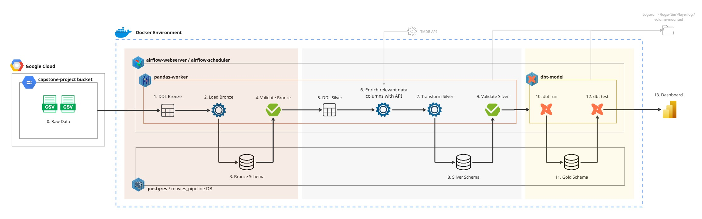

# Movies Data Pipeline — Medallion Architecture


End-to-end movies data pipeline ingesting raw CSVs from Google Cloud Storage, transforming through Bronze → Silver → Gold layers, and serving a star schema to Power BI.

---

## Overview

- Reads `movies_main.csv` and `movie_extended.csv` directly from GCS bucket `internship-capstone-movies` via `pd.read_csv("gs://...", dtype=str)` — no local file copies required
- Enriches ~38K movies with missing budget/revenue/genre data via the TMDB API (3 keys, round-robin)
- Materializes a star schema in PostgreSQL `gold` schema via dbt, ready for Power BI Import mode

+++ NEW: New-Device Reproducibility Guides +++

If you need to move this project to another laptop or desktop, start with these runbooks:

- [Start Here: New-Device Reproducibility Checklist](docs/01_start_here_checklist.md)
- [New Device Setup and Pipeline Run](docs/02_new_device_setup_and_pipeline_run.md)
- [Power BI Refresh and Dashboard Rebuild](docs/03_power_bi_refresh_and_dashboard_rebuild.md)
- [Validation and Troubleshooting](docs/04_validation_and_troubleshooting.md)

These guides are written for a first-time setup on a different machine and are intended to reduce dashboard rebuild work when transferring the project.

+++ END NEW: New-Device Reproducibility Guides +++



### Tech Stack

| Tool | Version | Role |
|------|---------|------|
| Python | 3.11 | Bronze + Silver processing |
| Pandas | 2.x | DataFrame transforms |
| Pandera | 0.18.x | Schema validation (Bronze + Silver) |
| Apache Airflow | 2.8.1 | Pipeline orchestration |
| dbt-postgres | 1.7.4 | Gold layer transformations |
| PostgreSQL | 15 | Central data store (3 schemas) |
| Docker Compose | — | Container orchestration |
| GCS | — | Raw data source (`internship-capstone-movies`) |
| TMDB API | v3 | Movie enrichment (budget, revenue, genres) |
| Power BI Desktop | — | Dashboard / BI layer |

---

## Project Structure

```
data-engineering-capstone-project/
├── dags/
│   └── movie_pipeline_dag.py        # Single Airflow DAG: Bronze → Silver → Gold
├── datasets/
│   ├── movies_main.csv              # Reference copy only — source of truth is GCS
│   └── movie_extended.csv           # Reference copy only — source of truth is GCS
├── dbt/
│   ├── dbt_project.yml              # dbt project config (materializations per layer)
│   ├── profiles.yml                 # PostgreSQL connection (reads DB_* env vars)
│   ├── macros/
│   │   ├── classify_budget.sql      # CASE WHEN → Blockbuster/Mid-Range/Low-Budget/Micro-Budget
│   │   └── pct_of_total.sql         # ROUND(numerator / NULLIF(denominator,0) * 100, N)
│   ├── models/
│   │   ├── staging/
│   │   │   ├── sources.yml          # Silver schema registered as dbt source
│   │   │   ├── schema.yml           # Generic tests for all 5 staging models
│   │   │   ├── stg_movies.sql
│   │   │   ├── stg_movie_genres.sql
│   │   │   ├── stg_movie_companies.sql
│   │   │   ├── stg_movie_countries.sql
│   │   │   └── stg_movie_languages.sql
│   │   ├── intermediate/
│   │   │   ├── schema.yml           # Generic tests for intermediate models
│   │   │   ├── int_movie_financials.sql    # Revenue rank per year, budget_tier via macro
│   │   │   └── int_yearly_movie_trends.sql # LAG/LEAD, YoY delta/%, 3yr rolling avg
│   │   └── marts/
│   │       ├── schema.yml           # Generic tests for all 9 mart/bridge models
│   │       ├── fact_movies.sql
│   │       ├── bridge_movie_genres.sql
│   │       ├── bridge_movie_companies.sql
│   │       ├── bridge_movie_countries.sql
│   │       ├── bridge_movie_languages.sql
│   │       ├── mart_genre_share.sql
│   │       ├── mart_language_share.sql
│   │       ├── mart_country_summary.sql
│   │       └── mart_yearly_trends.sql
│   └── tests/                       # 9 singular dbt tests (SQL assertions, expect 0 rows)
├── docker/
│   ├── airflow/Dockerfile
│   ├── dbt-model/Dockerfile
│   └── pandas-worker/Dockerfile
├── docker-compose.yml
├── docs/
│   └── system_architecture.jpg
├── postgres/
│   └── init.sh                      # Creates bronze/silver/gold schemas + airflow_metadata DB
├── scripts/
│   ├── bronze/
│   │   ├── bronze_ddl.py            # CREATE TABLE IF NOT EXISTS (all TEXT, with COMMENTs)
│   │   ├── bronze_load.py           # GCS → TRUNCATE + INSERT (dtype=str, chunksize=5000)
│   │   └── bronze_validate.py       # Pandera + row count vs GCS + NULL id check
│   └── silver/
│       ├── silver_ddl.py            # CREATE TABLE IF NOT EXISTS (typed: BIGINT, DATE, NUMERIC)
│       ├── silver_enrich.py         # TMDB API → silver.movies_enriched (supplement table)
│       ├── silver_transform.py      # Cast types, dedup, explode, SilverTableWriter class
│       └── silver_validate.py       # Pandera strict=True, value ranges, uniqueness
├── secrets/
│   └── gcs_key.json                 # GCS service account key — NOT committed to git
└── .env                             # Environment variables — NOT committed to git
```

---

## System Architecture

> TDD Artifact: System Architecture Diagram

**Data flow:**

```
GCS Bucket: internship-capstone-movies
    movies_main.csv  |  movie_extended.csv
            │
            │  pd.read_csv("gs://internship-capstone-movies/<file>", dtype=str)
            │  GOOGLE_APPLICATION_CREDENTIALS=/secrets/gcs_key.json
            ▼
    ┌─────────────────────────────────────┐
    │  BRONZE LAYER  (bronze schema)      │
    │  bronze.movies_main  (5 cols, TEXT) │
    │  bronze.movie_extended (5 cols, TEXT│
    └────────────────────┬────────────────┘
                         │
                         │  Type cast · dedup IDs · NULL handling
                         │  TMDB API enrichment (3 keys, ~38K rows, ~30 min)
                         ▼
    ┌──────────────────────────────────────────────────┐
    │  SILVER LAYER  (silver schema)                   │
    │  silver.movies              silver.movie_genres  │
    │  silver.production_companies                     │
    │  silver.producing_countries silver.spoken_languages│
    │  silver.movies_enriched  (TMDB supplement)       │
    └────────────────────┬─────────────────────────────┘
                         │
                         │  dbt: {{ source() }} → {{ ref() }}
                         │  staging views → intermediate views → mart tables
                         ▼
    ┌──────────────────────────────────────────────────┐
    │  GOLD LAYER  (gold schema — dbt managed)         │
    │  fact_movies + 4 bridges + 4 marts + 1 trend     │
    └────────────────────┬─────────────────────────────┘
                         │
                         │  Import mode, gold schema only
                         ▼
                  Power BI Desktop
                  localhost:5433
```

**Container responsibilities:**

| Container | Image | Role | Kept Alive By |
|-----------|-------|------|----------------|
| `postgres` | `postgres:15` | Central DB — bronze, silver, gold, airflow_metadata | healthcheck |
| `airflow-init` | custom/airflow | One-time DB init + admin user creation | exits after run |
| `airflow-webserver` | custom/airflow | Airflow UI on port 8080 | `restart: unless-stopped` |
| `airflow-scheduler` | custom/airflow | DAG scheduling + task triggering | `restart: unless-stopped` |
| `pandas-worker` | custom/pandas | Bronze + Silver script execution | `tail -f /dev/null` |
| `dbt-model` | custom/dbt | Gold layer `dbt run` / `dbt test` | `tail -f /dev/null` |

> `pandas-worker` and `dbt-model` have no long-running process. They stay alive via `tail -f /dev/null` and are invoked by Airflow using `docker exec`.

---

## Database / Data Model

> TDD Artifact: Database / Data Model Documentation

**Schema overview:**

| Schema | Purpose | Tables |
|--------|---------|--------|
| `bronze` | Raw ingested data — all TEXT, no transforms | `movies_main`, `movie_extended` |
| `silver` | Typed, cleaned, TMDB-enriched tables | `movies`, `movie_genres`, `production_companies`, `producing_countries`, `spoken_languages`, `movies_enriched` |
| `gold` | Star schema for BI — dbt-managed, materialized as tables | `fact_movies`, 4 bridge tables, 4 mart tables, 1 trend mart |

**Silver tables — key columns:**

| Table | Key Columns |
|-------|-------------|
| `silver.movies` | `movie_id` (BIGINT PK), `movie_title` (TEXT), `release_date` (DATE), `budget` (NUMERIC), `revenue` (NUMERIC) |
| `silver.movie_genres` | `movie_id` (BIGINT), `genre` (TEXT) |
| `silver.production_companies` | `movie_id` (BIGINT), `company_name` (TEXT) |
| `silver.producing_countries` | `movie_id` (BIGINT), `iso_country_code` (TEXT), `country_name` (TEXT) |
| `silver.spoken_languages` | `movie_id` (BIGINT), `iso_language_code` (TEXT), `language_name` (TEXT) |
| `silver.movies_enriched` | `movie_id` (BIGINT), `budget` (NUMERIC), `revenue` (NUMERIC), `genres` (TEXT) — TMDB supplement only |

**Gold star schema:**

| Model | Type | Materialization | Grain / Purpose |
|-------|------|----------------|----------------|
| `fact_movies` | Fact | table | One row per movie (scope: 1980–2016) |
| `bridge_movie_genres` | Bridge | table | movie_id ↔ genre (many-to-many) |
| `bridge_movie_companies` | Bridge | table | movie_id ↔ company |
| `bridge_movie_countries` | Bridge | table | movie_id ↔ producing country |
| `bridge_movie_languages` | Bridge | table | movie_id ↔ spoken language |
| `mart_genre_share` | Mart | table | Genre movie counts + % of total |
| `mart_language_share` | Mart | table | Language movie counts + % of total |
| `mart_country_summary` | Mart | table | Country, region, subregion, `is_service_restricted` flag |
| `mart_yearly_trends` | Mart | table | YoY delta, YoY %, 3yr rolling avg per release year |
| `int_movie_financials` | Intermediate | view | Revenue rank per year, `budget_tier`, `revenue_tier` |
| `int_yearly_movie_trends` | Intermediate | view | LAG/LEAD window functions for trend metric computation |

---

## Prerequisites

- Docker Desktop (running)
- Power BI Desktop
- GCS bucket `internship-capstone-movies` containing `movies_main.csv` and `movie_extended.csv`
- GCS service account JSON key with **Storage Object Viewer** permission
- 3 TMDB API v3 keys — [themoviedb.org](https://www.themoviedb.org/)
- `.env` file (see below)

---

## Environment Setup

> TDD Artifact: Configuration / Environment Documentation

### 1. Place GCS service account key

```
secrets/gcs_key.json    ← paste your downloaded JSON key file here
```

### 2. Create `.env` in the project root

```dotenv
# === PostgreSQL ===
POSTGRES_USER=capstone
POSTGRES_PASSWORD=capstone123
POSTGRES_DB=movies_pipeline

# === Port Mappings ===
POSTGRES_PORT=5433          # host-facing port (containers use 5432 internally)
AIRFLOW_PORT=8080

# === Airflow ===
# Generate key: python -c "from cryptography.fernet import Fernet; print(Fernet.generate_key().decode())"
AIRFLOW_FERNET_KEY=<your_fernet_key>

# === TMDB API Keys (3 keys for round-robin across 20 async workers) ===
TMDB_API_KEY_1=<your_key_1>
TMDB_API_KEY_2=<your_key_2>
TMDB_API_KEY_3=<your_key_3>
```

### 3. Start containers

```bash
# Build images + start all containers in detached mode
docker-compose up --build -d

# Verify all containers are running
docker ps --format "table {{.Names}}\t{{.Status}}"
```

Expected:

```
NAMES                  STATUS
postgres               Up (healthy)
airflow-webserver      Up
airflow-scheduler      Up
pandas-worker          Up
dbt-model              Up
```

> `airflow-init` exits after first run — that is expected behavior.

---

## Running the Pipeline

> TDD Artifact: Process / Workflow Diagram

**DAG task execution order:**

```
[bronze_tasks]
  ddl_bronze ──► load_bronze ──► validate_bronze
                                        │
[silver_tasks]                          ▼
  ddl_silver ──► enrich_silver ──► transform_silver ──► validate_silver
                                                                │
[gold_tasks]                                                    ▼
                                               dbt_run ──► dbt_test
```

### Option A — Airflow UI (recommended)

1. Open [http://localhost:8080](http://localhost:8080)
2. Login: `admin` / `admin`
3. Locate the `movie_pipeline` DAG
4. Click **Trigger DAG** (▶)
5. Monitor progress in Graph or Grid view

### Option B — Manual execution

```bash
# --- BRONZE ---
docker exec pandas-worker python /scripts/bronze/bronze_ddl.py
docker exec pandas-worker python /scripts/bronze/bronze_load.py
docker exec pandas-worker python /scripts/bronze/bronze_validate.py

# --- SILVER ---
docker exec pandas-worker python /scripts/silver/silver_ddl.py
docker exec pandas-worker python /scripts/silver/silver_enrich.py    # ~30 min (38K TMDB API calls)
docker exec pandas-worker python /scripts/silver/silver_transform.py
docker exec pandas-worker python /scripts/silver/silver_validate.py

# --- GOLD ---
docker exec dbt-model sh -c "dbt run  --project-dir /usr/app/movies --profiles-dir /usr/app/movies"
docker exec dbt-model sh -c "dbt test --project-dir /usr/app/movies --profiles-dir /usr/app/movies"
```

> `silver_enrich.py` calls the TMDB API for ~38K candidate movies at 20 req/sec across 3 keys. Expect ~30 minutes runtime — this is normal.

---

## dbt Gold Layer

> TDD Artifact: Technical Specs / Detailed Design

### Model Layers

| Layer | Folder | Materialization | Purpose |
|-------|--------|----------------|---------|
| Staging | `models/staging/` | view | Reads from silver via `{{ source() }}`, renames columns, applies scope filter (1980–2016) |
| Intermediate | `models/intermediate/` | view | Window functions (LAG/LEAD), financial rankings via `RANK()` |
| Marts | `models/marts/` | table | Final star schema tables — loaded by Power BI |

### Macros

| Macro | Parameters | Used In | Purpose |
|-------|-----------|---------|---------|
| `classify_budget(column_name)` | SQL column expression | `int_movie_financials` | `CASE WHEN` classifier → Blockbuster / Mid-Range / Low-Budget / Micro-Budget / Unknown |
| `pct_of_total(numerator, denominator, decimals)` | SQL expressions + int | `mart_genre_share`, `mart_language_share` | `ROUND(num::NUMERIC / NULLIF(denom, 0) * 100, N)` |

### Window Functions — int_yearly_movie_trends

```sql
LAG(movie_count)  OVER (ORDER BY release_year)  AS prev_year_movie_count
LEAD(movie_count) OVER (ORDER BY release_year)  AS next_year_movie_count
movie_count - LAG(movie_count) OVER (ORDER BY release_year)
                                                AS yoy_movie_count_delta
AVG(movie_count)  OVER (ORDER BY release_year ROWS BETWEEN 2 PRECEDING AND CURRENT ROW)
                                                AS rolling_3yr_avg_movies
```

### SilverTableWriter — silver_transform.py

Python class encapsulating all Silver DB writes. Applied consistently across all 5 transform functions.

```python
class SilverTableWriter:
    CHUNKSIZE = 5000

    def __init__(self, engine):
        self.engine = engine

    def write(self, df: pd.DataFrame, table_name: str) -> int:
        if df.empty:
            raise ValueError(f"Cannot write empty DataFrame to silver.{table_name}")
        df.to_sql(
            name=table_name, schema="silver", con=self.engine,
            if_exists="append", index=False, method="multi", chunksize=self.CHUNKSIZE
        )
        return len(df)
```

### Power BI Connection

1. **Get Data** → **PostgreSQL database**
2. Server: `localhost:5433`
3. Database: `movies_pipeline`
4. Load tables from the **`gold`** schema only
5. Load mode: **Import**

---

## Testing & QA

> TDD Artifact: Testing / QA Documentation

### Bronze — Pandera Validation (`bronze_validate.py`)

| Check | What It Validates |
|-------|------------------|
| Pandera schema strict=True | All expected columns present, no unexpected columns |
| Row count vs GCS | DataFrame row count matches re-read from GCS source file |
| NULL id check | No NULL values in the `id` column of either table |
| Column presence | Both `movies_main` and `movie_extended` tables have all required columns |

### Silver — Pandera Validation (`silver_validate.py`)

| Check | What It Validates |
|-------|------------------|
| Schema strict=True | Column names and dtype enforcement per silver table |
| Type enforcement | `movie_id` is BIGINT-compatible, `release_date` is datetime, `budget`/`revenue` are float |
| Value range checks | `budget >= 0`, `revenue >= 0` |
| Uniqueness | `movie_id` unique in `silver.movies` |
| NULL checks | `movie_id` and `movie_title` are not null |

### Gold — Generic Tests (57 total, via schema.yml)

Defined in `models/staging/schema.yml`, `models/intermediate/schema.yml`, `models/marts/schema.yml`:

- `not_null` — all required columns across staging, intermediate, and mart models
- `unique` — primary keys (`movie_id` in `fact_movies`, composite PKs in bridge tables)
- `accepted_values` — `budget_tier` ∈ `{Blockbuster, Mid-Range, Low-Budget, Micro-Budget, Unknown}`

### Gold — Singular Tests (9 total, dbt/tests/)

| Test File | Asserts |
|-----------|---------|
| `assert_scope_years_valid.sql` | No movies outside 1980–2016 reach the gold layer |
| `assert_fact_movies_no_orphan_bridges.sql` | All bridge `movie_id`s exist in `fact_movies` |
| `assert_no_duplicate_genres_per_movie.sql` | No duplicate (movie_id, genre) pairs in bridge |
| `assert_genre_pct_sums_over_100.sql` | Genre % sums exceed 100% (valid — multi-genre movies) |
| `assert_service_restricted_countries_have_region.sql` | Restricted countries (CN, RU, KP…) retain valid region + subregion |
| `assert_yearly_trends_complete_scope.sql` | All 37 years (1980–2016) present in `mart_yearly_trends` |
| `assert_budget_tier_coverage.sql` | No NULL `budget_tier` — `classify_budget` macro covers all ranges |
| `assert_yoy_delta_math.sql` | `yoy_delta == movie_count - LAG(movie_count)` for every row with a prior year |
| `assert_fact_counts_non_negative.sql` | All count columns in fact table are ≥ 0 |

**Run all dbt tests:**

```bash
docker exec dbt-model sh -c "dbt test --project-dir /usr/app/movies --profiles-dir /usr/app/movies"
```

---

## Logs

| Layer | Log File (host path) | Written By |
|-------|---------------------|-----------|
| Bronze | `./logs/bronze/bronze.log` | All `bronze_*.py` scripts via Loguru |
| Silver | `./logs/silver/silver.log` | All `silver_*.py` scripts via Loguru |
| Gold | dbt native logs inside `dbt-model` container | `dbt run` / `dbt test` |

**Live tail — PowerShell:**

```powershell
# Bronze
Get-Content -Path ".\logs\bronze\bronze.log" -Wait -Tail 50

# Silver
Get-Content -Path ".\logs\silver\silver.log" -Wait -Tail 50
```

---

## Key Design Decisions

| Decision | Reason |
|----------|--------|
| GCS as source of truth | Raw CSVs read directly via `pd.read_csv("gs://internship-capstone-movies/...", dtype=str)` — `datasets/` folder is reference-only, not used by the pipeline |
| TRUNCATE-before-INSERT | Idempotent loads at every layer — safe to re-run without duplicates |
| TMDB enrichment before transform | Enriched data (budget/revenue/genres) is merged during type-casting; patching after-the-fact would require a second pass |
| `pycountry` + `COUNTRY_FALLBACK` dict | Handles historic and disputed ISO codes not in the `pycountry` library (e.g., Soviet-era country codes) |
| Geographic region ≠ `is_service_restricted` | Service restriction is a platform access flag, not a content origin flag — restricted countries (CN, RU, KP) retain their real geographic region and subregion |
| `protobuf<5` pin | dbt 1.7.4 is incompatible with protobuf ≥ 5 — pinned in `docker/dbt-model/requirements.txt` |
| `tail -f /dev/null` keepalive | `pandas-worker` and `dbt-model` have no daemon process — this one-liner keeps them running for `docker exec` calls issued by Airflow |
| Docker socket mount | Airflow BashOperator uses `docker exec` to reach sibling containers — requires `/var/run/docker.sock` mounted into Airflow containers |
